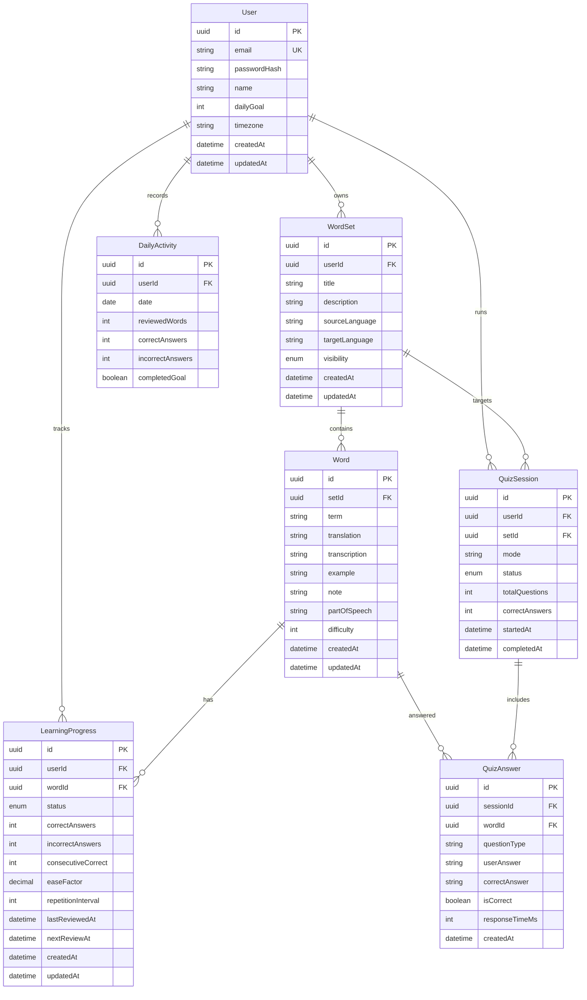

# WordForge — Архітектура системи (Architecture Documentation)

Документ описує високорівневу та деталізовану архітектуру вебзастосунку **WordForge** (LexiQuiz).

---

## 1. Структура проєкту (Monorepo Layout)

Проєкт організовано як monorepo з використанням `npm` / `pnpm` workspaces:

```text
/
├── apps/
│   ├── backend/             # NestJS REST API application
│   └── frontend/            # Next.js 14 (App Router) React SPA/SSR application
├── packages/
│   ├── shared-types/        # Спільні TypeScript інтерфейси, DTOs, Enums
│   └── eslint-config/       # Спільні правила линтингу ESLint
├── docs/
│   └── architecture.md      # Документ архітектури системи
├── docker-compose.yml       # Специфікація Docker (PostgreSQL, DB admin etc.)
├── .env.example             # Шаблон змінних середовища
└── package.json             # Root monorepo configuration & scripts
```

---

## 2. Основні модулі системи

### Backend (NestJS)
- **AuthModule**: Реєстрація, аутентифікація (JWT Access Token + HTTP-Only Cookie Refresh Token), вихід, оновлення токенів, хешування паролів (bcrypt).
- **UsersModule**: Управління профілем користувача, зміна щоденної мети, часового поясу, імені.
- **WordSetsModule**: Створення, редагування, видалення та пагінація власних наборів слів. Контроль доступу (Private / Link / Public).
- **WordsModule**: CRUD операцій зі словами у наборі, масове видалення, масовий ввід (Bulk import parser).
- **LearningModule**: Режим вивчення карток, фіксація фідбеку (`Again`, `Hard`, `Good`, `Easy`), розрахунок наступного повторення.
- **QuizzesModule**: Сервіси генерації квізів (`QuizGenerationService`, `QuizAnswerValidatorService`, `QuizSessionService`, `QuizScoringService`).
- **SpacedRepetitionModule**: Реалізація алгоритму інтервального повторення (SM-2 simplified).
- **StatisticsModule**: Підрахунок статистики вивчення, аналіз складних слів, історія активності.
- **DailyActivityModule**: Відстеження щоденної мети та серії днів (streak) з урахуванням часового поясу користувача.

### Frontend (Next.js)
- **Auth & Session**: Контекст авторизації, автоматичне оновлення токена через interceptors (axios / fetch).
- **Dashboard & Stats**: Головний екран із прогресом, активністю, щоденною метою та швидким стартом.
- **Sets Management**: Інтерфейси створення та редагування наборів слів, парсинг масового вводу з попереднім переглядом.
- **Flashcard Study Mode**: Інтерактивні фліп-картки з підтримкою мобільних жестів та гарячих клавіш.
- **Quiz Engine UI**: Екрани проходження квізів з 4 типами питань (вибір, введення, зворотний, правда/неправда).

---

## 3. Зв'язок Frontend та Backend

- **Протокол**: REST API over HTTP/HTTPS.
- **Формат даних**: JSON.
- **Документація API**: Swagger OpenAPI UI (`/api/docs`).
- **Авторизація**:
  - `Bearer <Access-Token>` у заголовку `Authorization` for API requests.
  - HTTP-Only Cookie (`refreshToken`) для безпечного оновлення access token.
- **Клієнтський стан**: TanStack Query (React Query) для кешування та серверного стану, Zustand для локального стану активного квізу.

---

## 4. Структура бази даних (PostgreSQL + TypeORM)



---

## 5. Схема авторизації

1. **Реєстрація / Вхід**: `POST /auth/register` або `POST /auth/login`. Сервер повертає `{ accessToken, user }` та встановлює cookie `refreshToken` (`httpOnly`, `sameSite`, `secure`).
2. **Access Token**: Короткоживучий JWT (наприклад, 15 хвилин), зберігається у пам'яті фронтенду.
3. **Refresh Token**: Довгоживучий JWT (наприклад, 7 днів), зберігається в `httpOnly` cookie.
4. **Оновлення токена**: Коли request повертає 401 Unauthorized, frontend робить автоматичний виклик `POST /auth/refresh` та повторює оригінальний запит.

---

## 6. Принцип роботи квізів

1. **Генерація session**: `POST /quizzes` приймає `setId` та `mode`. Сервер підбирає слова та типи питань.
2. **Варіанти відповідей (Multiple Choice)**:
   - 1 правильна відповідь.
   - 3 дистрактори з того самого або сусідніх наборів користувача.
   - Сервер НЕ повертає `correctAnswer` у GET запиті питання.
3. **Валідація**:
   - Для введення тексту: нормалізація рядка (trim, lowerCase, видалення подвійних пробілів).
   - Збереження спроби в `QuizAnswer`.
4. **Підсумок**: Після завершення оновлюється `QuizSession` та `LearningProgress` відповідних слів.

---

## 7. Принцип інтервального повторення (SM-2 variant)

- Кожне слово має свій `LearningProgress` запис зі статусом: `new` -> `learning` -> `reviewing` -> `mastered`.
- Параметри:
  - `easeFactor` (за замовчуванням 2.5).
  - `repetitionInterval` (в днях або хвилинах).
  - `consecutiveCorrect` (серія правильних відповідей).
- Оцінки користувача:
  - **Again (1 / Не знаю)**: скидання `consecutiveCorrect = 0`, interval = 10 хв, status = `learning`.
  - **Hard (2 / Важко)**: easeFactor = max(1.3, easeFactor - 0.15), interval = max(1, interval * 1.2).
  - **Good (3 / Знаю)**: consecutiveCorrect++, interval = if 1 step (1d), if 2 steps (6d), else (interval * easeFactor).
  - **Easy (4 / Легко)**: consecutiveCorrect++, easeFactor += 0.15, interval = max(7, interval * easeFactor * 1.3).
- Запит `GET /learning/due` вибирає слова, де `nextReviewAt <= NOW()`.

---
